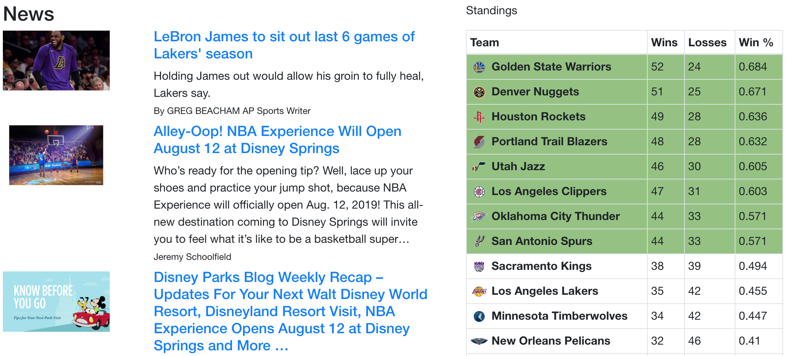
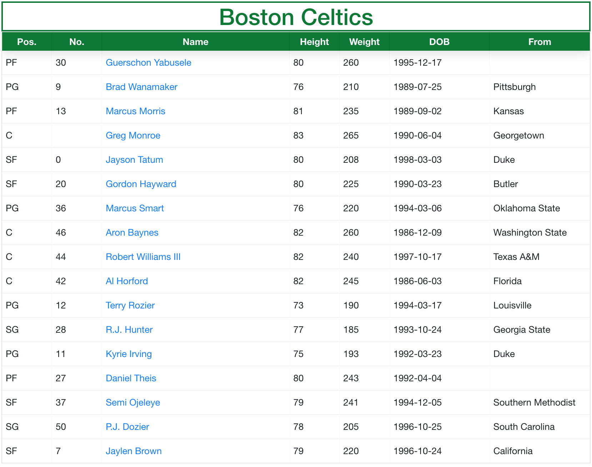
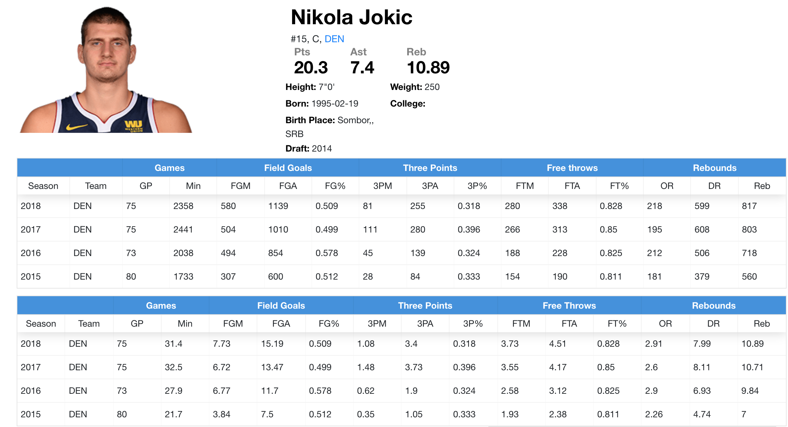

# Restart.Network: Independent Project (MERN Sack)
## NBA

This project uses [SportRadar](https://developer.sportradar.com/) NBA v5 trial API, [News API](https://newsapi.org/) as well as images from [NBA](http://www.nba.com/) and [ESPN](http://www.espn.com/) to create a prototype of a real NBA website.

The user is able to browse recent NBA-related news and up-to-date standings.

All team rosters with basic information about each player are provided as well.

Moreover, users can view career totals and averages for each of over 450 NBA players currently in the league.

